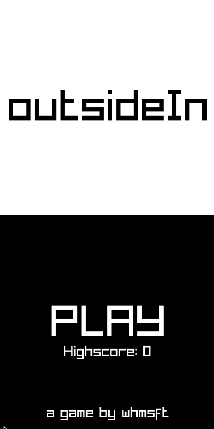

<h1 align="center">
  PopUp
  

  
  
   
  
   
  
</h1>

A tiny and simple game made with Raylib.

### How to play

It's simple, touch on either side of the screen to move in that direction.
You get point for turning upside down.
